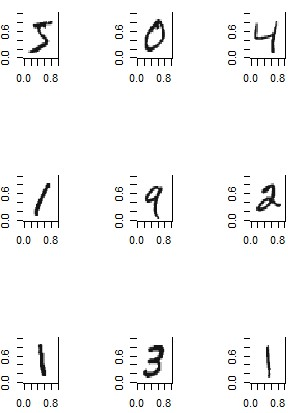

# R_RESTApi - Inference as a Service in R

This project was set up by Sonja Gassner and Veronica Pohl to gather the options to use a trained R model for production. We looked at the approach **"Inference as a Service"**. This means that the machine learning (ML) model is supposed to be deployed from R and an inference service is supposed to be made available as RESTful API.

## Project structure

The project is split into three sub-projects (three different possibilities to provide inference as a service using R models):  
* [Plumber](https://github.com/IndustrialML/R_RESTApi/tree/master/plumber)
* [OpenCPU](https://github.com/IndustrialML/R_RESTApi/tree/master/openCPU)
* //todo [Mircrosoft Machine Learning Server]()

All sub-projects take the MNIST data set of handwritten digits and train different models by using random forest. 


There are three models involved in the prediction:
* **empty model**: This model does not uses the input data and predicts always the number 0.
* **small model**: This model does use the input data. It was trained with random forest by using 50 trees and 60000 observations.
* **large model**: This model does use the input data. It was trained with random forest by using 500 trees and 60000 observations.

The R Script used for training the small and large models and the resulting models are provided in the  [models](https://github.com/IndustrialML/R_RESTApi/tree/master/models) directory.

The [docs](https://github.com/IndustrialML/R_RESTApi/tree/master/docs) directory contains detailed information about the three projects. 


The three projects were deployed on an Azure Linux Virtual Machine (VM). Details about the configuration of the VM can be found in the file [Configure_Azure_Linux_VM.md](https://github.com/IndustrialML/R_RESTApi/blob/master/docs/Configure_Azure_Linux_VM.md) in the docs directory.

## Plumber

### Requirements
* Installed [R](https://cran.r-project.org/) (version >= 3.0.0) and integrated development environment (IDE) for R like [RStudio](https://www.rstudio.com/).
* Installed [Docker](https://github.com/IndustrialML/R_RESTApi/blob/master/docs/Install_Docker.md)

### Getting started 
Assuming you have cloned at least the repository ["R_RESTApi"](https://github.com/IndustrialML/R_RESTApi) and installed the above requirements already.

#### 1. Create the Docker image 
For Windows in PowerShell:
1.	Set the directory from the dockerfile by `cd ~\R_RESTApi\plumber`
2.	`docker build . ` (This gives the image ID as `Successfully built 9f6825b856aa`). So in this example `<image ID>=9f6825b856aa` .
3.	`docker run -p 8080:8080 --name plumber 9f6825b856aa` So plumber runs on port 8080!

> ### :information_source: For Linux
> Same procedure as in Windows except that you have to put a "sudo" before every docker command for using it as an administrator!

#### 2. Make requests

If it stated “Starting server to listen on port 8080”, one can test the port and make GET/POST requests. The status **"200 OK"** means that the request has succeeded. You can make the requests using R directly, using [Postman](https://www.getpostman.com/ ), using Python or some other languages.
The url should look like this:

##### Local
* http://localhost:8080/predictemptypkg
* http://localhost:8080/predictsmallpkg
* http://localhost:8080/predictlargepkg

##### On a virtual machine
* http://lin-mlserver.westeurope.cloudapp.azure.com:8080/predictemptypkg
* http://lin-mlserver.westeurope.cloudapp.azure.com:8080/predictsmallpkg
* http://lin-mlserver.westeurope.cloudapp.azure.com:8080/predictlargepkg

Examples for requests can be seen in the repository ["IndustrialML/mlbenchmark"](https://github.com/IndustrialML/mlbenchmark) (Python), specially in docs in [*Make_Requests.md*](https://github.com/IndustrialML/R_RESTApi/blob/master/docs/Make_Requests.md), and [*../plumber/post_request_to_RESTApi.R*](https://github.com/IndustrialML/R_RESTApi/blob/master/plumber/post_request_to_RESTApi.R) (R).

### Inference as a Service

To get started with deploying a ML model from R to made an inference service available as RESTful API via plumber, we refer to [*Plumber_in_Docker.md*](https://github.com/IndustrialML/R_RESTApi/blob/master/docs/Plumber_in_Docker.md).

## OpenCPU
### Requirements
* Installed [R](https://cran.r-project.org/) and integrated development environment (IDE) for R like [RStudio](https://www.rstudio.com/).
* Installed [Docker](https://github.com/IndustrialML/R_RESTApi/blob/master/docs/Install_Docker.md)

### Getting started 
Assuming you have cloned at least the repository ["R_RESTApi"](https://github.com/IndustrialML/R_RESTApi) and installed the above requirements already.

#### 1. Create the Docker image 
For Windows in PowerShell:
1.	Set the directory from the dockerfile by `cd ~\R_RESTApi\openCPU`
2.	`docker build . ` (This gives the image ID as `Successfully built 9f6825b856aa`. So in this example `<image ID>=9f6825b856aa` .)
3.  `docker run -p 80:80 --name opencpu 9f6825b856aa` So OpenCPU runs on port 80!

> ### :information_source: For Linux
> Same procedure as in Windows except that you have to put a "sudo" before every docker command for using it as an administrator!

#### 2. Make requests
If it stated **"OpenCPU cloud server ready"**, one can test the port and make GET/POST requests. The status **"200 OK"** means that the request has succeeded. You can make the requests using R directly, using [Postman](https://www.getpostman.com/ ), using Python or some other languages.
The url should look like this:

##### Local
* http://localhost:80/ocpu/library/digiterEmpty/R/predict_digit_empty/json
* http://localhost:80/ocpu/library/digiterSmall/R/predict_digit_small/json
* http://localhost:80/ocpu/library/digiterLarge/R/predict_digit_large/json

##### On a virtual machine
* http://lin-mlserver.westeurope.cloudapp.azure.com:80/ocpu/library/digiterEmpty/R/predict_digit_empty/json
* http://lin-mlserver.westeurope.cloudapp.azure.com:80/ocpu/library/digiterSmall/R/predict_digit_small/json
* http://lin-mlserver.westeurope.cloudapp.azure.com:80/ocpu/library/digiterLarge/R/predict_digit_large/json

Examples for requests can be seen in the repository ["IndustrialML/mlbenchmark"](https://github.com/IndustrialML/mlbenchmark) (Python), specially in [*Make_Requests.md*](https://github.com/IndustrialML/R_RESTApi/blob/master/docs/Make_Requests.md), and [*../openCPU/performenceTest.R*](https://github.com/IndustrialML/R_RESTApi/blob/master/openCPU/performanceTest.R) (R). 

> ### :information_source: Status code
> Other than normally the status code for OpenCPU is **"201"** which means the request has been fulfilled and has resulted in one or more new resources being created. Therefore one should allow this status comming back e.g. in python in [*../test/test_mnist.py*](https://github.com/IndustrialML/mlbenchmark/blob/master/test/test_mnist.py) : 

```python
def call(self, data):
        response = requests.post(self.url,
                                 headers=self.headers,
                                 json=self.preprocess_payload(data)
        )

        if response.status_code == 200 | response.status_code == 201:
            return self.preprocess_response(response)

        else:
            return None
```

### Inference as a Service

To get started with deploying a ML model from R to made an inference service available as RESTful API via OpenCPU, we refer to [*OpenCPU_in_Docker.md*](https://github.com/IndustrialML/R_RESTApi/blob/master/docs/OpenCPU_in_Docker.md).

## Microsoft Machine Learning Server
### Requirements
//todo

### Getting started 
//todo Assuming you have cloned this repository and installed... 

1. //todo
2. //todo

### Inference as a Service

To get started with deploying a ML model from R to made an inference service available as RESTful API via Microsoft ML Server, we refer to [*MLserver.md*](https://github.com/IndustrialML/R_RESTApi/blob/master/docs/MLserver.md).

## Making Requests
For making requests in R, Postman, and Python, we refer to [*Make_Requests.md*](https://github.com/IndustrialML/R_RESTApi/blob/master/docs/Make_Requests.md).
