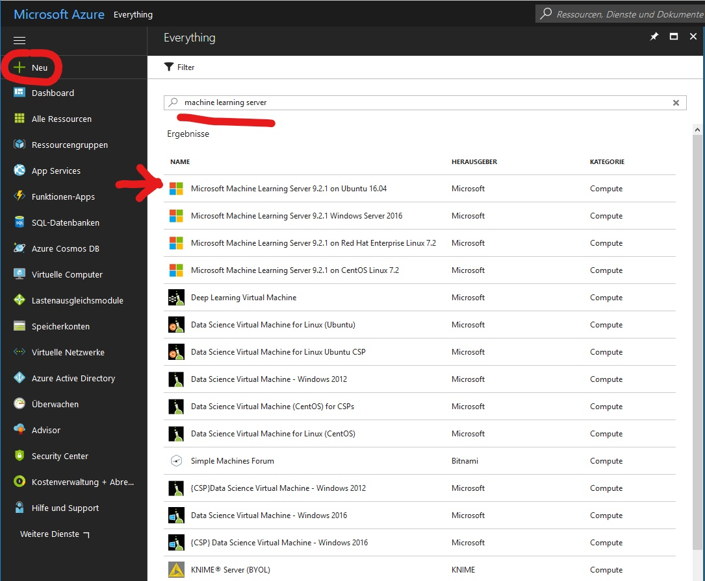
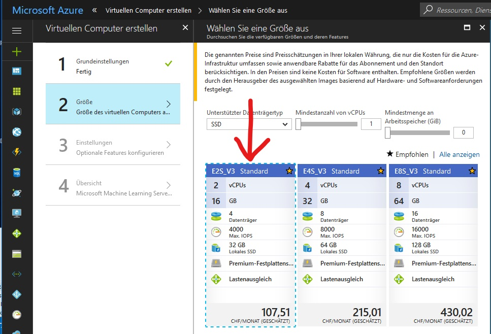
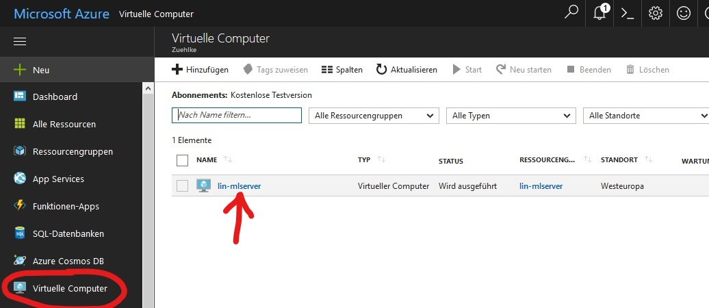
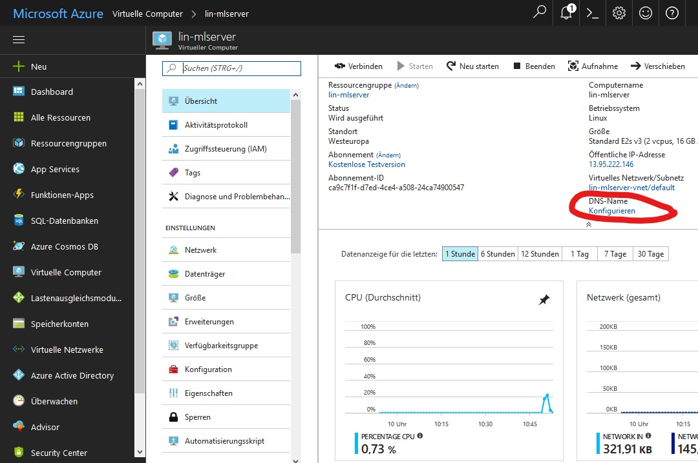
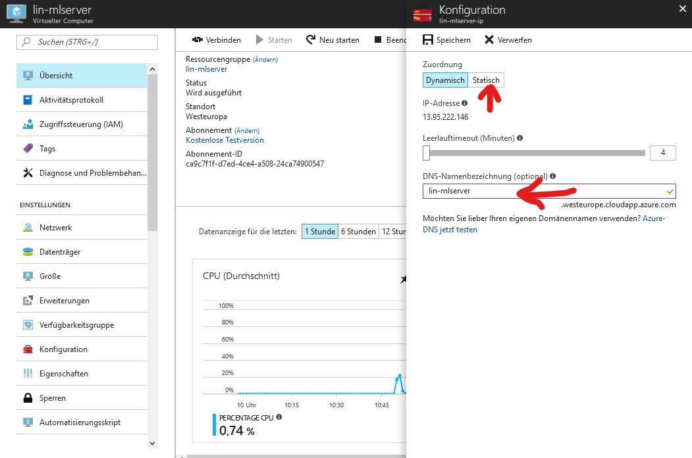
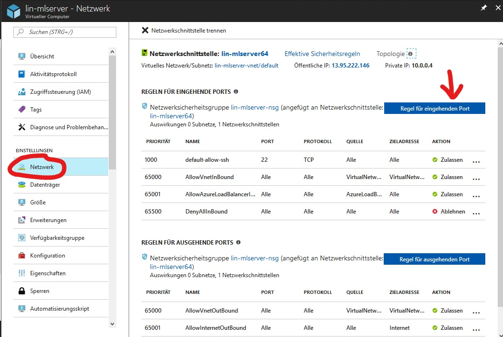
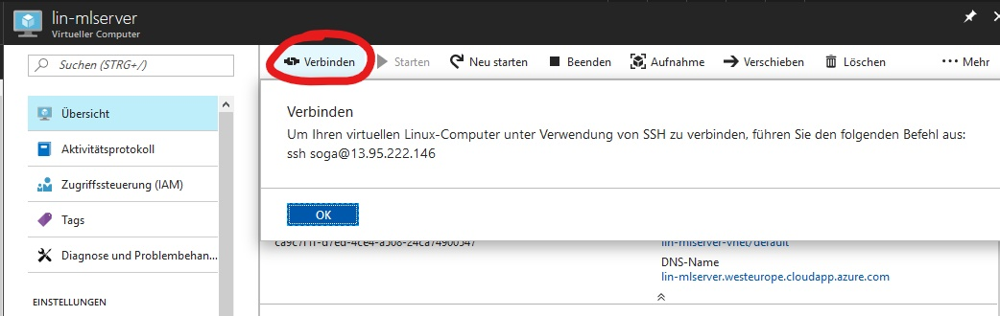
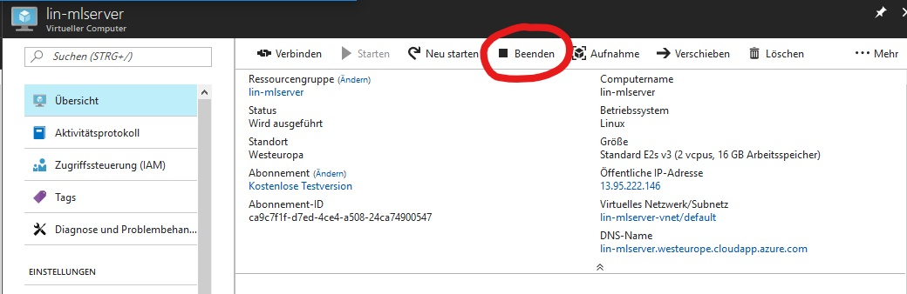

# Configuration of Azure Linux Virtual Machine

We used the following Azure Virtual Machine to compare the different options to provide inference as a service for trained R models.

## **Assemble VM in [Azure Portal](https://portal.azure.com):** 
Create an Azure Account with free trial version [here](https://azure.microsoft.com/de-de/offers/ms-azr-0044p/). 
In [Azure portal](https://portal.azure.com) search for "Machine Learning Server" to see the available VMs with R Server installed.

We used the VM with Microsoft Machine Learning Server 9.2.1 for Linux (Ubuntu 16.04). Select it and klick on "Create". Then what follows is a configuration menu to create the VM. 

We used the VM of type E2S_V3 with 2 CPUs and 16GB RAM.
  
In Tab 3 we used the default settings.   
In Tab 4 -> Create. 

It takes some time to set everything up, but eventually your VM is created. 
In order to be able to get R Server up and running, you need to first do a few configurations, some in the Azure Portal and some when logged into the VM:

## Configurations in Azure Portal
#### **IP-address and DNS name:**   
You can set the IP address to static, so it doesn't change over time. 
Also, it we set up a DNS name, which can be used instead of the IP-address in HTTP-requests.  
In the tab overview select your VM -> Overview Tab -> DNS-Name -> Configure

#### **Define Rules for incoming Ports in Azure Portal:**  
For the Ports you want to use for your service, you need to create inbound rules:  
Virtual Machines -> Select your VM -> Network -> Rule for incoming Port -> Select Port, Priority and choose a Name -> ok

In the end, we had configured inbound rules for the following ports: 80, 8000, 8080, 8003, 8004, 8005, 12800.
Port 12800 will be taken by MS ML Server, the other ports by various other REST Api services. 

## Configurations on Linux VM
#### **Connect to VM:**   
Connect to VM via ssh. (on Windows, you can use e.g. Git Bash as SSH client):    

**Remark**: Connecting does **not** work when in VPN!  

So whenever you get a time out when trying to connect to your VM, first check if your VPN-connection is really switched off. 

`ssh username@DNSname` or  
`ssh username@IPaddress`

In our case the login with the DNS name would be 
`ssh soga@lin-mlserver.westeurope.cloudapp.azure.com` or (since we set our IP to be static) 
`ssh soga@13.95.222.146`. You get this info when you click on "Connect". 

#### Change Firewall settings 

If on Linux and using the IPTABLES firewall or equivalent service, use the iptables command (or the equivalent) to open the necessary ports to the public IP of the web node so that remote machines can access it. In order to use MS ML Server, you need to use port 12800.

Example: Allow all incoming HTTP connections for port 12800:
`sudo iptables -A INPUT -p tcp --dport 12800 -m conntrack --ctstate NEW,ESTABLISHED -j ACCEPT`

We did the same for all ports for which we defined rules for incoming Ports in Azure Portal (ports 80, 8000, 8080, 8003, 8004, 8005)

Save the established rules:
`sudo apt-get install iptables-persistent` -> Y, Yes

## Additional Information

#### Get your files onto the VM
The easiest way is to clone the repository containing your files to the VM. (Git is already installed on the VM we chose.)

#### Shut down VM after usage

