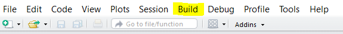
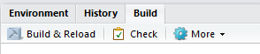
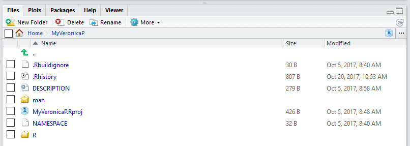

# Create R Package

## Requirenments
* Installed [R](https://cran.r-project.org/) (version >= 3.0.0) and integrated development environment (IDE) for R like [RStudio](https://www.rstudio.com/).

## Make R Package in RStudio
1. Click "New Project" -> "New Directory" -> "R Package"
2. In console: 
```{r}
 install.packages(“devtools”) #for data
 install.packages(“roxygen2”) #for NAMESPACE 
```
3. In the menu bar : Click "Build" -> "Configure Build Tools"



Choose "Package" and "Generate documentation with Roxygen" (choose all options). Then click "OK".

4. Optional (because normally not needed but automatic build in RStudio): Delete *hello.R* in folder /R and *hello.Rd* in folder /man .

5. Create *R file* with the coordinated preamble as follows:
```R
#' Title of this function
#'
#' @param <parameter> Description of parameter
#' @return Description of returned value(s)
#' @import packages, which should be installed
#'
#' @export (this is the command that one can use the function if the package is loaded)
```

One example can be seen in *digiterSmall/R/predict_digit_small.R*.

6. Save the created *R file* in folder /R.
7. Type in console: `load_all()`. This should produce a *DESCRIBTION-file* in the project folder. With the coordinated preamble the “roxygen2” package should produce a *.Rd-file* in the folder /man. Further, a *NAMESPACE-file* is created. Please check this.
8. Open the *DESCRIPTION-file* and change it as follows:
```{r}
Package: MyPackageName
Type: Package
Title: What The Package Does (one line, title case required)
Version: 0.1.0
Author: YourName
Maintainer: YourName <your e-mail address>
Description: More about what it does (maybe more than one line). Use four spaces (____) when indenting paragraphs within the Description.
License: What license is it under? (mostly GPL-3)
Encoding: UTF-8
LazyData: true
Depends: package (>= or <= version)
Suggests: package which is not needed but suggested
RoxygenNote: version 

```

One example can be seen in *digiterSmall/DESCRIBTION.file*

> ### :exclamation: Dependence on packages
> Be sure that all packages which are needed in `#' @import packages, which should be installed` are listed in "Depends" in the *DESCRIBTION-file*.


9. Save the *DESCRIBTION-file*.
10. To save data or trained models into your package use the following in the console:
```{r}
model <- readRDS(file = "model.rds")
devtools::use_data(model, internal = TRUE, overwrite = TRUE)
```

This saves the model into the folder /R as *sysdata.rda* . If the package is loaded, one can use the data or model without loading it by hand. 
One example of such a model builder can be seen in the file */digiterSmall/modelbuilder/build_model_help.R*. 

11. To ignore some folders or files choose the automatic created *.Rbiuldignore-file* and include `^namefolder$`.

One example can be seen in *digiterSmall/.Rbuildignore*.

> ### :information_source: *.Rbuildignore-file*
> It is recommended that the folder /modelbuilder with the file *build_model_help.R* should be included in *.Rbuildignore-file*.

12. In the tabs (Environment, History, Build, Git): Click "Build and Reload" for pushing all your saved changes into the package. Please check if errors occur!



13.	Click "Check" to check the package. Please check, if errors occur as follows:
```{r}
R CMD check results
0 errors | 0 warnings | 0 notes

R CMD check succeeded
```

14.	If the check succeed, click "More" -> "Build Source Package". This generates the file *MyPackageName_0.1.0.tar.gz*.

Your folder structure should look like:


One example can be seen in the folder /digiterSmall.
