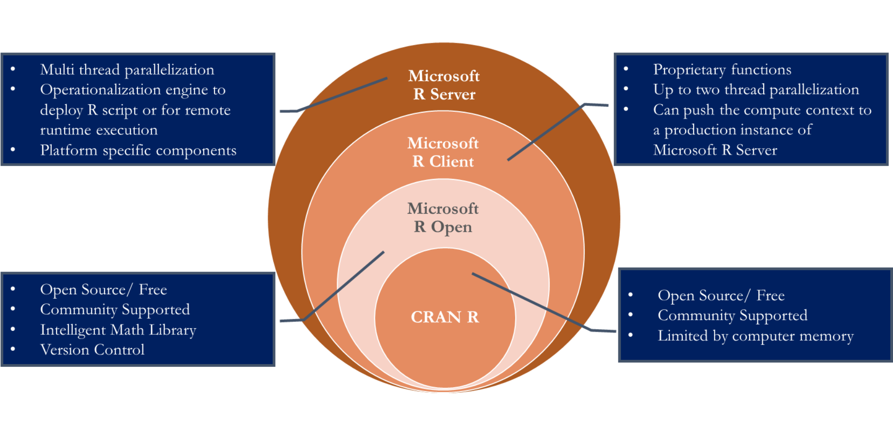
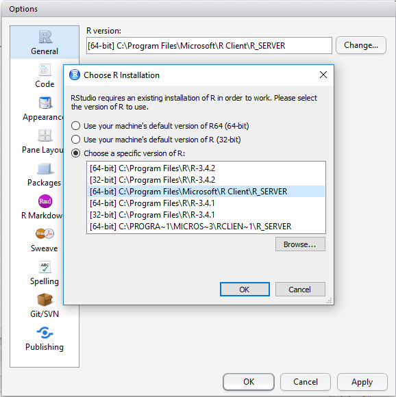
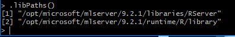

# How to deploy an R model with Microsoft ML Server

## Terminology

Microsoft offers a whole framework for operationalizing Machine Learning Models trained in R or Python. The framework includes "a collection of R packages, Python packages, interpreters, and infrastructure for developing and deploying distributed R and Python-based machine learning and data science solutions on a range of platforms across on-premises and cloud configurations".     
This whole framework is referred to as **Microsoft Machine Learning server**.

Microsoft Machine Learning Server (short: ML Server) used to be called Microsoft R Server (up to Release 9.1.0), and was renamed to ML Server (Release 9.2.1) when support for Python based analytics was added. Now R Server is a part of ML Server. (Not sure if R Server is available stand-alone anymore.)

Since we were working with R, we will from now on focus on the R (and R Server) part only.

## Different R Distributions
If you are a regular R user, you probably always work with the open source distribution of R available at CRAN and have never heard about any other distributions of R. Nevertheless, there are a few other ones available developed by Microsoft.  

There is a nice overview about those different R distributions given [here](https://www.linkedin.com/pulse/microsoft-r-open-source-which-suits-you-best-tathagata-mukhopadhyay/). Short summary:

* **CRAN R**: open source R (runs on memory, so computation time depends on computer hardware)
* **Microsoft R Open**: uses multithreaded Intel Math Kernel Library (MKL) for matrix manipulations
* **Microsoft R Client**: includes proprietary packages with  functions to      
    * enable parallel computing, up to two threads (functions with suffix *rx*, e.g. `rxGlm()` instead of `glm()`) 
    * allow to push the compute context to a remote machine or 
    * publish models to a remote machine to provide inference as a service.
* **Microsoft R Server**: parallel computing (more than two threads) and can process data in multiple data nodes

The first three distributions are available for free, the last one (R Server) is licensed. 

## Setup

If you want to deploy your R model on a remote machine using R Server, you need to first do the following setup steps:

### Local machine: Install R Client
In order to publish models trained on your local machine on a remote machine with ML Server installed, you need to install MS R Client on your local machine. You can download it for free [here](https://docs.microsoft.com/en-us/machine-learning-server/r-client/install-on-windows) -> how to install.

You can use MS R Client using your favorite IDE for R. If you want to use it in RStudio, you need to change the R version used in the global options:
Tools -> Global Options -> General -> R Version

### Remote machine: Install and configure ML Server
#### Install ML Server on remote machine
Details on how to install ML Server for various platforms are given [here](https://docs.microsoft.com/en-us/machine-learning-server/install/machine-learning-server-linux-install). Since we used an Azure Virtual Machine (VM) with ML Server already installed, we could skip this step. 

*Please note that the documentation from here on is Linux specific.*

After installing ML Server, you still have to do the following configuration to actually be able to use it:

#### **Configure ML Server**  
Although R Server is already installed within ML Server, you still need to configure it to act as a deployment server and host analytic web services before use. There are two possible configurations: One-Box and Enterprise. Details about these two possibilties can be found [here](https://docs.microsoft.com/en-us/machine-learning-server/operationalize/configure-start-for-administrators). We used a One-Box Configuration. 
Details on this configuration can be found  [here](https://docs.microsoft.com/en-us/machine-learning-server/operationalize/configure-machine-learning-server-one-box) for ML Server.  
We did the configuration as follows:

When connected to your remote Linux machine via ssh, run the administration utility using the following shell commands: 

`cd /opt/microsoft/mlserver/9.2.1/o16n/Microsoft.RServer.Utils.AdminUtil`  
`sudo dotnet Microsoft.MLServer.Utils.AdminUtil.dll`

Then do the following (these instructions are given [here](https://docs.microsoft.com/en-us/machine-learning-server/install/operationalize-r-server-one-box-config) (Section "How to perform a one-box configuration", Number 2. as well)):

a. Choose the option to *Configure server* (or in previously releases, Configure R Server for Operationalization).

b. Choose the option to *Configure for one box* to set up the web node and compute node onto the same machine.    
Important:
Do not choose the suboptions Configure a web node or Configure a compute node unless you intend to have them on separate machines. This multi-machine configuration is described as an Enterprise configuration.

c. When prompted, provide a password for the built-in, local operationalization administrator account called 'admin'.

d. Return to the main menu of the utility when the configuration ends.

e. Choose the option *Run diagnostic tests* to test if the configuration was successful. Choose option *Test configuration*. Afterwards, you need to authenticate: Username: admin, Password: \<*Password set in step c.*\> If everything is configured well, you will get the notification that all diagnostic tests have passed. 

#### R-Package installation on ML server
As a last setup step, you need to find the library where the packages you need during REST API requests have to be installed. 
Connect to VM and start an R session as administrator:
`sudo R`    
In the R session, use the command `.libPaths()` to find the path to the R library used at runtime during REST API requests: 

The second is the library which is accessed during API requests. So every package needed during an API request has to be installed there first (one time only). In our case, we needed the package randomForest, since the prediction was made using `predict.randomForest()`. You can install the necessary R package into a specified library as follows:

`install.packages("randomForest", lib = "/opt/microsoft/mlserver/9.2.1/runtime/R/library")`

## Web Service Types
Now we are ready to deploy our pre-trained models on R Server. 
MS offers two types of web services (Standard and Realtime) in the ML Server framework. A detailed description can be found [here](https://docs.microsoft.com/de-de/machine-learning-server/operationalize/concept-what-are-web-services).

#### Standard Web Service

These web services offer fast execution and scoring of arbitrary Python or R code and models. 
The R code of how to set up our standard web services is given in the file 
 `ms_rclient_mlserver.R`
 
**Remarks/Drawbacks of Standard Web Service:**  
We wanted to create 3 web services (corresponding to 3 trained models as described in the README.) However, we did not succeed to publish the largest model (153 Mb) as web service (publishing took more than 3 hours and at some point the process was stopped, seems like the model was too large).

#### Realtime Web Service

Here you can only use functions of MS's propriety R packages (`RevoScaleR` and `MicrosoftML`) to fit models. [Here](https://blogs.msdn.microsoft.com/mlserver/2017/10/15/1-million-predictionssec-with-machine-learning-server-web-service/) it says that "Realtime web services offer lower latency to produce results faster and score more models in parallel. The improved performance boost comes from the fact that these web services do not depend on an interpreter at consumption time even though the services use the objects created by the model. Therefore, fewer additional resources and less time is spent spinning up a session for each call. Additionally, the model is only loaded once in the compute node and can be scored multiple times."     

However, the claimed great performance does not apply in all cases, as we found out during our work. More information regarding this issue see the last remark below. 

The code on how we set up our Realtime Web Services is given in the file `MLServer/ms_rclient_mlserver_realtime.R`

Note that these services are available for Linux only since ML Server 9.2.1. For Windows they have been available longer, since R Server 9.1.0.    

**Remarks/Drawbacks:**    
A few remarks/drawbacks from a practical point of view:

* For realtime web services it was not possible to create a Baseline Web Service (only returning the same number, without model) like we did for all other web service types, since you cannot publish arbitrary code for this type of web service, you can only publish fitted models. Hence we used the empty model of the standard web service as baseline. 
* Regarding MicrosoftML:    
 Currently (November 2017) only the functions of the RevoScaleR package really work for our purpose, since there is the following bug in the MicrosoftML function  `rxPredict.mlModel()`:  
If you have a model trained with a function of MicrosoftML and you now want to predict the response of new data points (which by definition don't have a response value), then this is not possible, since the function `rxPredict.mlModel()` needs a response column. :-(  Hence we were only able to work with the RevoScaleR functions.
* Regarding runtime:    
The realtime web services with models trained using functions of RevoScaleR are fast for data sets with few features (many observations are not a problem). However, they are not for data sets with many features (i.e. parameters), regardless of how many observations there are, as can be seen in the following simulation study (code given in *MS_MLserver/realtime_simulation-study.R*). 
We got the following results, they are saved in *MS_MLServer/realtime_simulation-study_output/*.   

For the **rxLogit()** function (results saved in *mean_times_rxLogit_fit.rds* ):

| features        | n           | time.fit  | time.publish  | mean.time.pred.loc  | mean.time.pred.api  |
| -------------:  |------------:| ---------:|--------------:|--------------------:|--------------------:|
|  8 | 60000   |  0.22    |     0.45           |  0.0116     |        0.0367 |
|78 |60000  |   3.90   |      0.28   |          0.0243    |         0.0464|
|784| 60000  | 389.59|         0.41   |          0.2236     |        0.1625|
|784|  6000  | 207.59 |        0.37    |         0.2120      |       0.1564|

For the **rxDTree()** function (results saved in *mean_times_rxDTree_fit.rds* ):  

| features | n           | time.fit  | time.publish  | mean.time.pred.loc  | mean.time.pred.api  |
| ------:  |------------:| ---------:|--------------:|--------------------:|--------------------:|
|        8 |  60000      |      1.94 |       0.44    |         0.1235      |       0.0789
|       78 |  60000      |      8.64 |        0.34   |          0.1179     |        0.0644
|      784 |  60000      |     79.92 |        0.32   |          0.1600     |        0.3264
|      784 |  6000       |     28.71 |        0.34   |          0.1453     |        0.3218

The times in the tables are in seconds. Legend:    
* **features** = Number of features (columns) in data set    
* **n** = Number of observations (rows) in data set    
* **time.fit** = time it took to fit the corresponding model to a data set with dimensions n*features    
* **time.publish** = time it took to publish the model on ML Server    
* **mean.time.pred.loc** = mean time over 100 predictions on local machine    
* **mean.time.pred.api** = mean time over 100 realtime api prediction requests    

## Swagger Files and POST requests with and without R
Consider section 2 of the make requests documentation [here](https://github.com/IndustrialML/R_RESTApi/blob/master/docs/Make_Requests.md).

