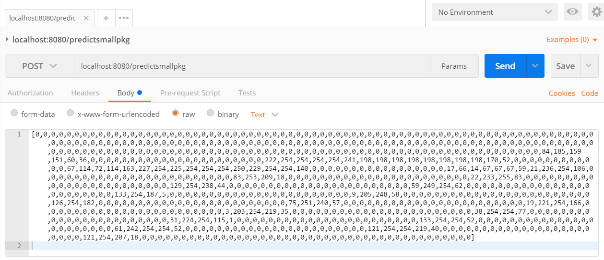
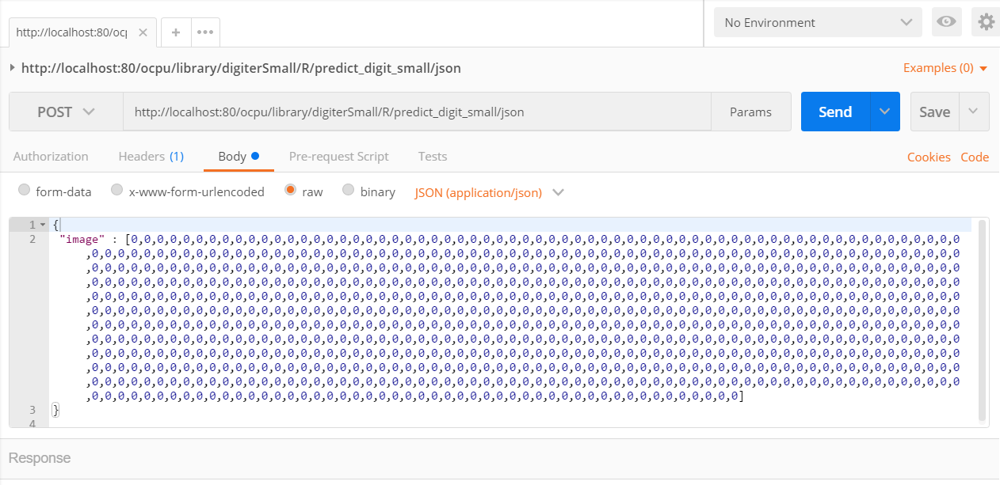
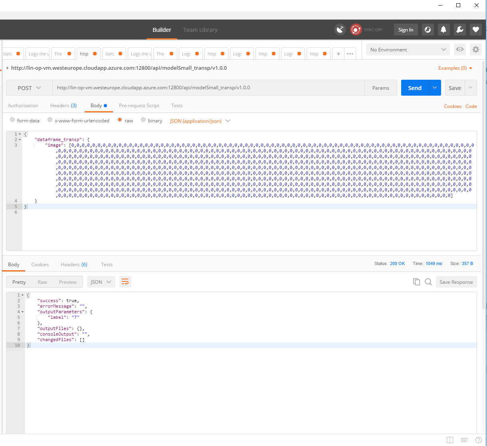
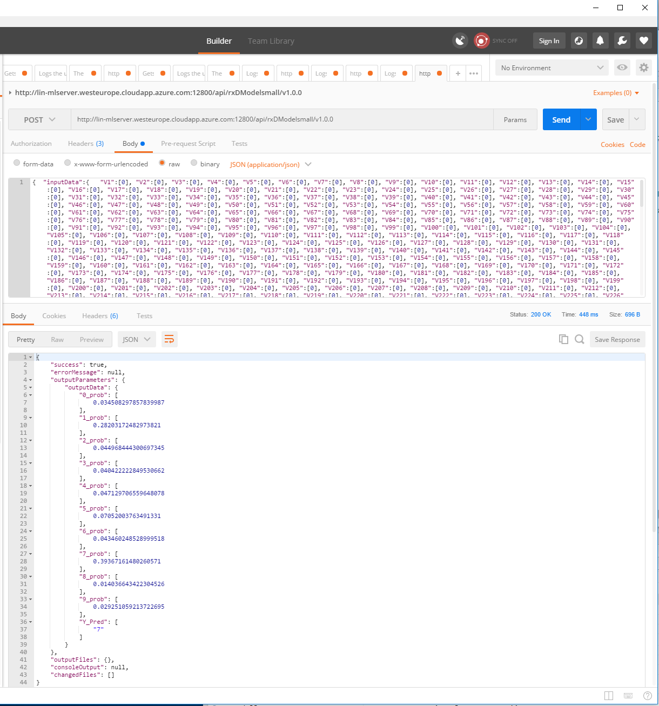


# Make Requests

There are many opportunities to make requests. In the following three of it are listed to make GET/POST requests for the R code from [R_RESTApi](https://github.com/IndustrialML/R_RESTApi) in [IndustrialML](https://github.com/IndustrialML) on github. 

The most frequent status of a request are:
* **"200 OK"**: The request has succeeded.
* **"201 Created"**: The request has been fulfilled and has resulted in one or more new resources being created. 
* **"400 Bad Request"**: The server cannot or will not process the request due to something that is perceived to be a client error (e.g. malformed request syntax, invalid request message framing, or deceptive request routing).

## 1. R

### Requirenments
* [R](https://cran.r-project.org/) (version >= 3.0.0) 

### Procedure for Running
In R there exists the packages ["httr"](https://cran.r-project.org/web/packages/httr/httr.pdf) and ["RCurl"](https://cran.r-project.org/web/packages/RCurl/RCurl.pdf) which both make GET and POST requests out of R.

Some examples are shown 

* for [plumber](https://www.rplumber.io/) in */plumber/post_request_to_RESTApi.R*
* for [OpenCPU](https://www.opencpu.org/) in */openCPU/performanceTest.R*
* for MS ML Server in *ms_rclient_mlserver.R* or *ms_rclient_mlserver_realtime.R*.

Please try them!

## 2. Postman

### Requirenments
* [Postman](https://www.getpostman.com/)

### Procedure for making requests when using plumber or OpenCPU

1. Choose between GET and POST.
2. Enter the request url including port number.
3. If you chose a POST request: Click to "Body" and enter your data.
4. If your request need an authorization, specialize an authorization!
5. Click "Send".

Example for POST request with

* **plumber**: In "Body" choose "raw" and enter a 784 (28x28) length vector with gray-scale values between 0-255 such as

```{r}
[0, 0, 0, 251, 251, 211, 31, 80, 181, 251, ..., 253, 251, 251, 251, 94, 96, 31, 95, 251, 211, 94, 59]
```


* **OpenCPU**: In "Body" choose "raw", choose "JSON(application/json)" and enter a 784 (28x28) length list with the label "image" and gray-scale values between 0-255 such as
```{r}
{
 "image" :  [0, 0, 0, 251, 251, 211, 31, 80, ..., 251, 251, 251, 94, 96, 31, 95, 251, 211, 94, 59]
}
```



### Procedure for making requests when using MS ML Server
After publishing the web services from within R, sending POST requests from within R is pretty simple, as shown in the R Scripts *ms_rclient_mlserver.R* or *ms_rclient_mlserver_realtime.R* in the *MS_MLserver*-directory. But they can of course be consumed by any client sending a POST request in json. We sent requests from outside of R using [Postman](https://www.getpostman.com/). In order to do this, follow the following steps:

1. Within R, get the Swagger Files to be imported to Postman as shown at the end of *ms_rclient_mlserver.R* or *ms_rclient_mlserver_realtime.R*. 
2. Import the Swagger file, take care of authorization and send the POST request as described [here](https://blogs.msdn.microsoft.com/mlserver/2017/02/22/rest-calls-using-postman-for-r-server-o16n-2/).    
**Remark** After importing the Swagger File to Postman, you have to adjust the urls in all calls, since they don't get imported correctly. E.g. we had to replace `https:///api` with `http://matleo-mlserver.westeurope.cloudapp.azure.com:12800/api` in all calls.    

#### Example calls
Here are a few example calls for various endpoints constructed in `/ms_rclient_mlserver.R` and `/ms_rclient_mlserver_realtime.R`. The structure of the body of the call in json depends on the R code used to provide the prediction. 
In R, the most natural way is to make a post request by sending (and expecting) data as a data frame, so one observation would be a data frame with 1 row and as many columns as there are features.
In json, a data frame is represented as a dictionary, with the keys being the column names, and the values being the colum vectors. So a data frame called `df` with columns X1 and X2 as follows     

| X1 | X2           | 
| ------:  |------------:| 
|        1 |  4      |
|       2 |  5      | 
|      3 |  6      |   

would be represented as    

```{r}
{
“df”: {
“X1”: [1,2,3],
“X2”: [3,4,5]}
}
```
in json.

However, if you have many features (as in our case 784) this leads to a rather nasty call in json if you have many features (shown in the 2nd image). Therefore, we circumvented this issue by rewriting the R code for the prediction such that it accepts a "transposed" data frame (`dataframe_transp`) with 1 column(`image`) and as many rows as there are features. This corresponds to the API `modelSmall_transp` in `/ms_rclient_mlserver.R`. The corresponding json call from Postman looks as follows (call at the top, response at the bottom):


With realtime APIs, unfortunately this hack is not possible, since there the only thing you can publish is the trained model, there is no way to publish any R-code on how to perform the prediction. Thus, you have to send the data in the standard data frame form, which leads to the following call in json (the columns of the 784 features of the MNIST data are called V1, ... , V784 by default in R):

**Remark:** Note that for realtime APIs, the data frame *has* to be called `inputData`. 


## 3. Benchmark using Python

### Requirenments
* Python 2, 2.6, 2.7, 3 or 3.3
* Optional: [Anaconda](https://docs.anaconda.com/)

### Code for Running

In Python the code [mlbenchmark](https://github.com/IndustrialML/mlbenchmark) in [IndustrialML](https://github.com/IndustrialML) on github is used. This code makes for every REST API request three scenarios: "Accuracy", "Sequential Load" and "Concurrent Load". The output is a tabular of results. Anaconda prompt is used:

1. Set working directory to mlbenchmark folder with `cd ~\mlbenchmark`
2. `pip install -r requirements.txt`
3. `python setup.py develop`
4. `py.test`


> ### :exclamation: Change requests
> To change the running REST API requests one have to make changes in* ENVIRONMENTS = [...]* in file  *test/test_mnist.py* ! Besides, one have to choose the right environment for the different tools: "MNistEnvironment" for plumber, "OpencpuMNistEnv" for OpenCPU and "MSMLServerMNistEnv" or "MSMLServerRealtimeMNistEnv" for MS ML Server (in the old days R Server).


